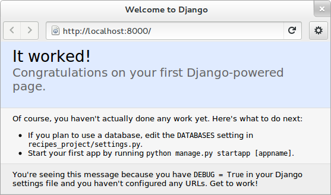
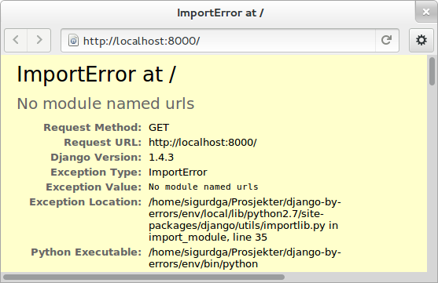
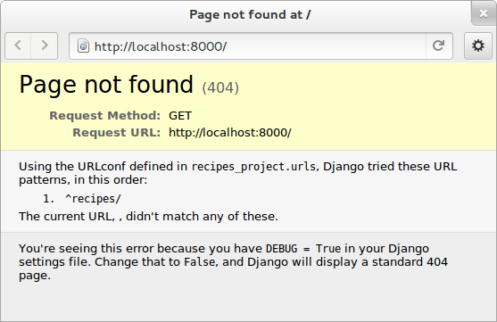
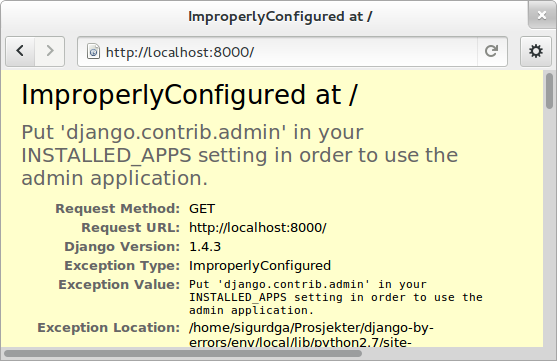
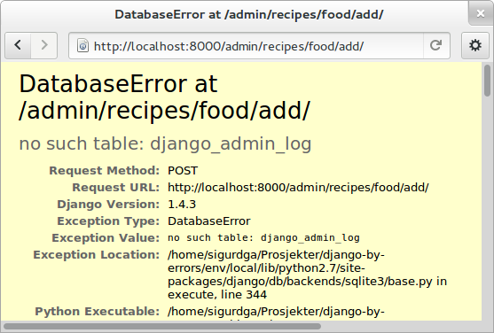
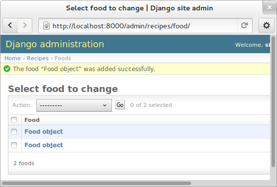
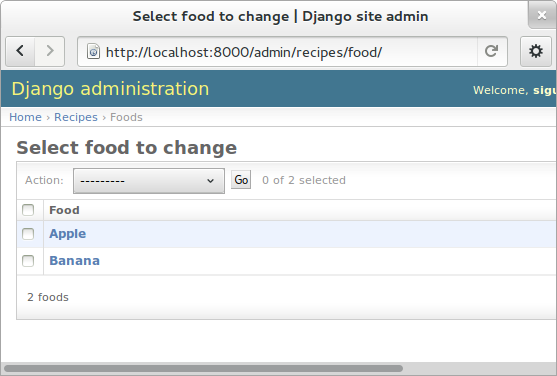
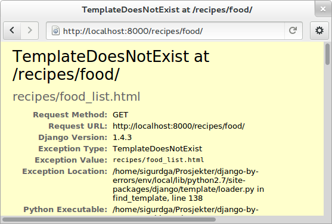
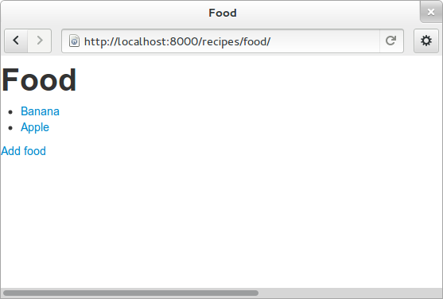

.. Djecipes documentation master file, created by
   sphinx-quickstart on Wed Oct 24 13:44:06 2012.
   You can adapt this file completely to your liking, but it should at least
   contain the root `toctree` directive.

##############################################
Django by errors - a different Django tutorial
##############################################

************
Introduction
************

In this tutorial, we will focus on how to build a recipe site by taking one
step at a time, seeing what error is waiting for us next.

When learning a new programming language or framework, there are so many guides
and tutorials on how to do everything right. But what do you do the first time
you get an error?

Here, we will be accustomed to as many error messages as possible while
building a small site.

In this tutorial, you will also learn how to use South for database migrations,
and Twitter Bootstrap for a nice default site styling.

About Django
============

`Django`_ is a web application framework written in `Python`_. As Python,
it is Free software, licenced under the `BSD license`_, and it has lots of
documentation and a large community.

.. _Django: https://www.djangoproject.com/
.. _Python: http://www.python.org/
.. _BSD license: http://en.wikipedia.org/wiki/BSD_licenses

Django fosters **rapid development**, using an easy-to-learn and easy-to-read
language like Python will let you not only make the computer understand what
you mean, but also the people who may eventually inherit your scripts.

The components of Django are **loosely coupled**, so you can use another templating
language instead of Django's own, and you can even change the model layer to
use Sqlalchemy instead of the built-in Django ORM (Object relational mapper:
the layer that translates your models to database language).

In this tutorial, you will create a project, and then an application in that
project. Django is built in a way that you will also be able to use third party
applications inside your project, and you will in most cases start with a
couple of Django applications. You can then build your apps in your projects in
a way that you can mix them around and **reuse** them in other projects.

One of the most important parts is that you should not write the same code over
and over again. So in Django projects you should not see long sections
duplicated over and over. The "class based views" we are going to use is one
good improvement to this, and the template inheritance system is another way
you will **not repeat yourself**.

************
Simple steps
************

In this part, you will learn the most basic parts of Django, to get a feeling
of how Django applications are built.

We assume you have a computer with Python installed, as all modern operating
systems come with Python installed. To check if python is installed, open up a
terminal, write "python" and press enter. If the command was not found, you
should install Python.

We will also use "virtualenv". It should not be too hard to install, just check
out their official `installation documentation`_.

.. _installation documentation: http://www.virtualenv.org/en/latest/#installation

Starting a project
==================

Find a place where you want your project, and create a virtual environment to
keep your requirements and dependencies separated from the rest of your python
system. And activate your new virtual environment::

    virtualenv --no-site-packages env
    source env/bin/activate

You are now "inside" this virtual environment. You can type "deactivate" to get
out of it. But be sure to be inside when installing Django::

    pip install django

Now that Django is installed you have a new command inside the "bin" folder in env,
which you can use to start a new Django project. I have named mine
"recipes-project"::

    ./env/bin/django-admin.py startproject recipes_project

Go into the **project folder**, make the ``manage.py`` script runnable and
start the *built-in webserver*::

    cd recipes_project
    python manage.py runserver

Now go to ``localhost:8000`` in your web browser.  You can stop the server by
pressing ``ctrl-c`` as suggested by the command output.

The page congratulates you, and tells you about your next steps: you should
update your database settings and create an **app**.  The apps are meant to be
*reusable* components that you can tie together when building projects.

Have a look around in your project folder. You will see a folder with the same
name as your project, *recipes_project*. This is where central project configuration
and common code will live.

Contents of project folder::

    $ ls
    manage.py  recipes_project

Contents of configuration folder::

    $ ls recipes_project
    __init__.py   settings.py   urls.py   wsgi.py
    __init__.pyc  settings.pyc  urls.pyc  wsgi.pyc

The pyc-files are compiled versions of the source files. We do not need to
bother too much about them, and if you remove them, they get recreated when the
source file is run.

Database setup
--------------

The welcoming page told us to setup the database. The database settings are
part of the *settings.py* file in the configuration folder. Open up
``recipes_project/settings.py`` in your favourite text editor, and change the
database settings: Append ``sqlite3`` to the ``ENGINE`` field and add a database
name to the NAME field, "database.db" is a good name::

    DATABASES = {
        'default': {
            'ENGINE': 'django.db.backends.sqlite3',
            'NAME': 'database.db',
            'USER': '',
            'PASSWORD': '',
            'HOST': '',
            'PORT': '',
        }
    }

The database name will be the name of a local file in your project folder.
Sqlite is a single-file database system that is easy to use when developing,
but not recommended in a production for large sites.

Creating an app
===============

The welcoming page also wanted you to create an app. Do this using the
``manage.py`` command in the project folder::

    python manage.py startapp recipes

This will create a new folder structure for the new app besides "manage.py" and the inner "recipes_project", like this::

    $ ls
    manage.py  recipes  recipes_project

And the new *recipes* folder contains this::

    $ ls recipes
    __init__.py  models.py  tests.py  views.py

Activating the app
------------------

Now, you should enable your new app in the project settings, by appending the
name of your app to the ``INSTALLED_APPS`` tuple, near the bottom. The section
should look something like::

    INSTALLED_APPS = (
        'django.contrib.auth',
        'django.contrib.contenttypes',
        'django.contrib.sessions',
        'django.contrib.sites',
        'django.contrib.messages',
        'django.contrib.staticfiles',
        # Uncomment the next line to enable the admin:
        # 'django.contrib.admin',
        # Uncomment the next line to enable admin documentation:
        # 'django.contrib.admindocs',
        'recipes',
    )

The extra comma at the end is optional on the last line, but I recommend it.

Now, to route traffic to the newly created app, we also need to add a line to
the list of url patterns Django will use to match incoming requests. In the
project level ``urls.py``, you will see a line like this::

    # url(r'^recipes_project/', include('recipes_project.foo.urls')),

The code with "#" in front is "commented out" and will not run. To make it
active, remove the "#" and the first space. We will also change the line itself
so it reads::

    url(r'^recipes/', include('recipes.urls')),

It is useful to keep a terminal always running ``python manage.py runserver``, and
use another terminal window or tab for all the other commands you need to run.

Refresh the browser and see that complains: "No module named urls"

The line we just activated tells Django to look for url patterns in a file at
"recipes/urls.py", but that file does not exist yet. Copy the urls.py from the
project folder into the app folder, and remove all the commented code and url
patterns so that the new file looks like this::

    from django.conf.urls import patterns, include, url

    urlpatterns = patterns('',
            )

Go to the browser and refresh. Now it says "Page not found (404)" which is a
generic error message about a page not being found, but this also tells you
what alternatives you have.

The page suggests that you should append "recipes/" to the address field of
your browser.  Go ahead, try it, and see that you get the first "It worked!"
page again as there were no errors, but also, no contents.

***************************
Models, views and templates
***************************

There are different ways to organize code so it will not end up as a pile of
spaghetti.  Have a look again in the recipes *app* folder, you'll see four
files ending in '.py'. The *__init__* is needed for the Python module that the
app is to work, *models* will contain your models, *tests* will contain your
tests, and *views* is the code that will build up different "pages"::

    $ ls recipes
    __init__.py   models.py   tests.py  urls.pyc
    __init__.pyc  models.pyc  urls.py   views.py

Later we will add *templates* as well: `HTML`_ code that will decide the layout
and design of your pages. The templates folder is not created automatically as
it is possible to put templates other places as well.

.. _HTML: https://en.wikipedia.org/wiki/Html

If you are coming from another language or framework, you will eventually see
that the templates are stricter than you are used to. You are not allowed to
put tons of functionality into the template code  A graphical designer should
be able to understand and change the templates without knowing Python or
Django.

Your first model: Food
======================

That's enough theory for a while. Now we will add a very simple model to
``models.py``. This is the model for all the types of food we will use in the
recipes. It will only have one field we need to know of, the *name* of the food
objects. Django will automatically give it an *id* field for the primary key.
Add the following class to recipes/models.py::

    class Food(models.Model):
        name = models.CharField(max_length=20)

This model has to be used by the database. Django has a manage command called
``syncdb`` that will setup and all tables needed by Django for us. But wait a
minute. Using a third party tool called *south* we can get database migrations
as well.

Set up database migration support
---------------------------------

Database migrations let you script the database changes so you can go from one
version to another without manually executing ``alter table`` or other `SQL`_
commands. You can also use this for data migrations, but we will not get into
that now. You need a third party app called "South" to do this. There have been
discussions about taking all or parts of South into the core of Django 

.. _SQL: https://en.wikipedia.org/wiki/Sql

In settings.py, add ``'south',`` to the bottom of the INSTALLED_APPS to use
that app as well as your own. When saving the file, the running "runserver"
process will stop, telling::

    Error: No module named south

You need to install the "south" app::

    pip install south

And restart your server.

To create your first migration belonging to the *recipes* app/module, run use
the *init* subcommand::

    python manage.py schemamigration recipes --init

This will only create the migration, not do anything to the database, as you
can create more migrations and execute them at the same time. It will also
prevent the *syncdb* command from creating your databases without migration
support.

To actually run this command, you need to run the management command
``migrate``. This will only take care of your new app (since this is the only
one with migrations defined). To do both *syncdb* and *migrate* at the same
time, run::

    python manage.py syncdb --migrate

The first time syncdb is run, it will ask you to create a user. We will soon be
using the built-in admin interface where you later can create users, but to log
in and create users, you need a user, so please answer "yes" and fill in the
information. The output will look similar to this::

    Superuser created successfully.
    Installing custom SQL ...
    Installing indexes ...
    Installed 0 object(s) from 0 fixture(s)
    Migrating...
    Running migrations for recipes:
     - Migrating forwards to 0001_initial.
     > recipes:0001_initial
     - Loading initial data for recipes.
    Installed 0 object(s) from 0 fixture(s)

    Synced:
     > django.contrib.auth
     > django.contrib.contenttypes
     > django.contrib.sessions
     > django.contrib.sites
     > django.contrib.messages
     > django.contrib.staticfiles
     > south

    Migrated:
     - recipes

The output from the syncdb command states that all apps specified in
INSTALLED_APPS, except for your recipes, has been set up using the normal
syncdb, and that your recipes app has been set up using a migration. Good.

Set up admin interface
----------------------

Now we will utilize the built-in Django Admin. In ``urls.py`` in the project
folder, **uncomment** the lines regarding *admin*::

    from django.conf.urls import patterns, include, url

    # Uncomment the next two lines to enable the admin:
    from django.contrib import admin
    admin.autodiscover()

    urlpatterns = patterns('',
       # Examples:
       # url(r'^$', 'recipes_project.views.home', name='home'),
       url(r'^recipes/', include('recipes.urls')),

       # Uncomment the admin/doc line below to enable admin documentation:
       # url(r'^admin/doc/', include('django.contrib.admindocs.urls')),

       # Uncomment the next line to enable the admin:
       url(r'^admin/', include(admin.site.urls)),
    )

We have already set up an url pattern to forward everything starting with
*recipes/* to the python module *recipes.urls*, and now everything starting
with "admin" will redirect to the admin interface we will soon take a closer
look at.

If you refresh your browser at this time, you will get an error about your site
being improperly configured.

The error message suggests that you should put ``django.contrib.admin`` in the
INSTALLED_APPS section of settings.py. It is already there, you just need to
uncomment it.

After uncommenting the admin app, have a look in your browser. No matter what
address you go to, the server will not find it, and suggests you should try
``localhost:8000/admin/``. Go there and have a look.

.. image:: admin_login.png

You should now be able to log in and have a look around. You should see some
predefined classes from Django like User and Group, but Admin can also take
care of your Food model. To get that to work, you need to create a file in the
recipes folder called "admin.py". The file should contain::

    from django.contrib import admin
    from recipes.models import Food

    admin.site.register(Food)

On browser refresh, nothing changes. When adding new models to admin, you need
to restart the server. Just stop it (ctrl-c) and restart the runserver command.

You should now be able to see your Food model in the list.  Click on it and try
to add some food objects, like "Banana" or "Apple".

You will now get an error complaining about missing tables. This is because you
added the admin inteface after the last run of "syncdb", so the tables admin
needs are not created. Just run the same syncdb command again::

    python manage.py syncdb --migrate

This time, the output also lists "django.contrib.admin" as a synced app.

Adding a method to your model
-----------------------------

When you have successfully created a few kinds of food, you will see in the
list that it list a few lines of *Food object*.

This is not very useful, as it is not possible to distinguish between the lines
in the list. In your models.py add a function named ``__unicode__`` inside your
Food class (at the same indentation level as the "name"). Make it return
``self.name``, like this::

    def __unicode__(self):
        return self.name

When refreshing the list, your table should look more user friendly. The
__unicode__ is utilized by Django to write a human readable version of the
object. Later, for example in templates, you could just print the object
without saying what parts of the object you want to print, and let the
__unicode__ for that class decide.

Your first view: Food list
==========================

Admin does everything nice and tidy, but you don't want to expose the admin
inteface to your users. We have to create a simpler representation to show to
our users.

Open up ``recipes/views.py`` and paste in this code::

    from django.shortcuts import render_to_response
    from django.template import RequestContext
    from recipes.models import Food

    def food_list(request):
        food = Food.objects.all()
        return render_to_response('recipes/food_list.html', {'object_list': food}, context_instance=RequestContext(request))

The ``food_list`` method will fetch all ``Food`` objects from the database.
Hold them in a variable named ``food``, and send this variable to a *template*
named ``food_list.html``, but as a variable named ``object_list`` exposed to
the template.

Go to your app's urls.py and add an import statement to the top::

    from recipes.views import food_list

And a line to the pattern list to get all food::

    url(r'^food/$', food_list, name='food-list'),

Now ``/recipes/food/`` should trigger the newly created ``food_list`` function.
Go to this address and see what you get.

You got an error message. It tells you to make a template named
"recipes/food_list.html".

Bootstrapping a template
------------------------

We will make this template in a folder named "templates/recipes" inside the app
folder. From inside the recipes folder, create the template folders::

    mkdir -p templates/recipes

And create a file in the newly created folder called ``food_list.html``
containing (copied from
http://twitter.github.com/bootstrap/getting-started.html and changed to serve
static media from Django's locations):

.. code-block:: html+django

    <!DOCTYPE html>
    <html>
    <head>
    <title>Bootstrap 101 Template</title>
    <!-- Bootstrap -->
    <link href="{{ STATIC_URL }}css/bootstrap.min.css" rel="stylesheet">
    </head>
    <body>
    <h1>Hello, world!</h1>
    
    
    </body>
    </html>

This template needs some files from the *Twitter Bootstrap* project, so in your
app folder, download twitter bootstrap static files, unzip and rename the
directory to ``static``::

    wget http://twitter.github.com/bootstrap/assets/bootstrap.zip
    unzip bootstrap.zip
    rm bootstrap.zip
    mv bootstrap static

Have a look at the file structure there and compare to the explanations at
http://twitter.github.com/bootstrap/getting-started.html. It should be alright.

You need to stop and start the server again, as the new templates folder is
only picked up at server restart.

Now, refresh the web browser and see the page saying "Hello, world!".

Add a *div* tag with class *container* around the *h1* and see how the page
changes.

Change the template by changing the *h1* tag and the *title*, and after the *h1*
(but inside the new div), print the contents of the ``object_list`` template
variable we created above, like this:

.. code-block:: html+django

    <ul>
    
    <li>{{ object }}</li>
    
    </ul>

Refresh your browser and see. We want to see some details about the food we
have created, but we do not know the addresses to these pages yet, so we will
insert empty links (a href="") around the {{ object }}. Insert this instead of
``{{ object }}``, (inside the *li*-tag):

.. code-block:: html+django

    <a href="">{{ object }}</a>

Also add an empty link at the bottom of the page that will later be used for
adding more food to our list.

.. code-block:: html+django

    <a href="">Add food</a>

The template should now look similar to this:

.. code-block:: html+django

    <!DOCTYPE html>
    <html>
    <head>
    <title>Food</title>
    <!-- Bootstrap -->
    <link href="{{ STATIC_URL }}css/bootstrap.min.css" rel="stylesheet">
    </head>
    <body>
    

        <h1>Food</h1>

        <ul>
        
        <li><a href="">{{ object }}</a></li>
        
        </ul>

        <a href="">Add food</a>
    

    
    
    </body>
    </html>

A simpler view
--------------

The view function we made earlier gives us full control over what happens. But
it is long, and making a few of these requires a lot of typing. To make sure
you *don't repeat yourself* too much, you can use the newer "Class based
generic view"s instead.

In *views.py*, remove the file contents and insert this instead::

    from recipes.models import Food
    from django.views.generic import ListView

    class FoodListView(ListView):
        model = Food

And the urls.py should import the new FoodListView instead of food_list, and
the pattern should be changed to this::

    url(r'^food/$', FoodListView.as_view(), name='food-list'),

Here, instead of calling the view function directly, we are now calling the
``as_view`` function on the FoodListView class we just created. Our
``FoodListView`` does not define this ``as_view()`` function, but inherits it
from the ``ListView`` model class of the ``django.views.generic`` module.

Have a look in the browser. The functionality is the same, the code a bit
shorter. But you should know how to write this yourself as we did in the first
version of it.

Your second view: Food details
==============================

In the views.py, append ``DetailView`` (comma separated) to the *django.views*
import statement at the top, and add another class at the bottom of the file::

    class FoodDetailView(DetailView):
        model = Food

Add another pattern to the urls.py, and remember to import it at the top::

    url(r'^food/(?P<pk>\d+)/$', FoodDetailView.as_view(), name='food-detail'),

You see that the last parameter is "name". This is used to alias the possibly
long and ugly urls full of parameters to nice little strings. Another good
thing about this is that we can change the format of your urls without updating
all the places where it is used. This concept is called "named urls" in Django,
and this way, the url patterns are used both for url pattern matching *and*
link url generation.

Insert the name of the url you need into the address field of your
first template, so the line becomes:

.. code-block:: html+django

    <li><a href="">{{ object }}</a></li>

Also, the url patterns can take in parameters. The ``<pk>`` part of the pattern
says that you want to match the primary key field of the object. The primary
key field is for all common cases the hidden auto-incremented numerical *id*.
That is why we send in the ``object.id`` when using this to create the url. The
other common way to address objects is to use a *slug*, and we will have a look
at that further down this document.

When you have a look at the web browser now, you see by hovering the mouse over
the links that they point somewhere. By clicking one of them, you will see we
need to make another template. *templates/food_detail.html* is missing.

PIC: missing recipes/food_detail.html

Copy the template you already have to ``food_detail.html`` in the same folder.
Change the new template to add a new *title*, *h1* and the *contents* itself.
The contents is not too much fun as we do only have one field in the Food
model.  Add a few ``
``-tags with the object id and name, and a link back to
the list, like this:

.. code-block:: html+django

    
<a href="">Back to food list</a>

    
{{ object.id }}

    
{{ object.name }}

You can be happy if the detailed page looks something like this when you
refresh the browser.

Don't repeat yourself: Use a common base
----------------------------------------

When you look at the two templates, you see that there is a lot of common code
in them. Not good. Create a new template *one folder level up* called
"base.html" with the common code, like this:

.. code-block:: html+django

    <!DOCTYPE html>
    <html>
    <head>
    <title>Generic title</title>
    <!-- Bootstrap -->
    <link href="{{ STATIC_URL }}css/bootstrap.min.css" rel="stylesheet">
    </head>
    <body>
    

    
    <h1>Generic title</h1>

    Nothing interesting yet

    
    

    
    
    </body>
    </html>

You see some placeholder text in there, inside some blocks ````. Blocks are made to be overridden in templates extending them.

Now remove the common code from the other two templates and add a line at the
top to tell them to **extend** the new base template. Then override the two
blocks, title and content in both templates. The list template now looks like
this::

    

    Food list

    
    <h1>Food list</h1>
    <ul>
    
    <li><a href="">{{ object }}</a></li>
    
    </ul>
    

Now, the browser should look exactly the same for the two views. If you see the
generic text of the base, then you do not override the blocks using the same
names.

Create more objects
===================

Add a link to the food list page with the text "Add food", and with an empty
link (to be updated later).

Append CreateView to the django.views import at the top of views.py, and create
a new view like::

    class FoodCreateView(CreateView):
        model = Food

In the urls.py, add the new FoodCreateView to the import at the top, and add a
new url pattern::

    url(r'^food/new/', FoodCreateView.as_view(), name='food-create'),

Now you can update the create link in the list template to use the new and
named ``food-create``, like this::

    <a href="">Add food</a>

Clicking the new link will also give an error about a missing template.

PIC: Missing recipes/food_form.html

The error message tells us that "recipes/food_form.html" is missing. Create it
and make it look similar to the other two templates, but we will add a form to
it::

    

    Add food

    
    <h1>Add food</h1>

    <form>
        {{ form }}
        <button type="submit">Save</button>
    </form>
    

We haven't added any action or method parameters to the form at this time. The
``{{ form }}`` tag will let Django show the fields that represent the models.
And we also have a standard submit button. Have a look at the form in the
browser.

PIC simple food form

Primary action button
---------------------

To make it slightly nicer, add a ``class="btn btn-primary"`` to the submit
button. Looks better? This is because of the styling we get from Twitter
Bootstrap.

###HER

A more crispy form
------------------

We will also make the form layout a bit nicer with the third party **Crispy
Forms** module. To INSTALLED_APPS add ``crispy_forms`` and install
django-crispy-forms with pip::

    pip install django-crispy-forms

Below the extends line in the form, add::

    

And add the ``crispy`` filter to the form variable. Not the best example with
only one variable in the form.

Making the form post
--------------------

Now, add a fruit name and click "Save". The url changes, but you are still on the same page. Our Django view will answer differently on GET and POST requests, but we did not tell the form to use the http POST method. Change the form definition to use the POST method::

    <form method="POST">

If we try again, we will see another error, complaining about "Cross site
request forgery". Django uses an established mechanism to decide that a request
originates from the same site. This is done by using the ``SECRET`` in
settings.py to generate a combination of characters that will be attached as
hidden fields to all forms, and then be validated on the servers when the form
is posted. All you have to do is to add a ```` to your form.
Add this e.g. at the same line as the form definition tag, like this::

    <form method="POST">

Now, try to save again. Another error! So much errors, so much to learn! This
time Django complains about not knowing where to send you after the form has
been parsed and your object saved. You would need to define either a
``success_url`` in the view, to tell it where to go, or you can let Django go
back to the detailed view for the object. This is kind of a default option, as
long as you have a ``get_absolute_url`` method defined in your model. Head over
to models.py and add a method at the bottom of your Food class (on the same
indentation level as ``__unicode__``)::

    @models.permalink
    def get_absolute_url(self):
        return ('food-detail', [self.id])

The ``@models.permalink`` gives a short and easier way to write a url than when
calling ``reverse`` yourself.

Now, go back and add a fruit and click save. Nice? If you now have two fruits
with the same name, that is because your fruit got added even though your
success link were missing.

To be sure you will never register the same fruit twice, you can add
``unique=True`` within the definition of ``name`` in your model class.

Now you know how to add a model and some views to list, see details or add new
objects.

More models
===========

To be able to create recipes, we need at least two more models. A recipe model
is obvious, where we can add ingredients and a description of how to use the
ingredients. But how do we connect the recipes to the food objects?

Adding ManyToMany(REF) is too simple, then we only know what ingredients we
use, but not how much of what. You can read about ManyToMany, and you should be
able to understand how to do it after you have finished the next steps.

# TODO: Add figure

We need to say what Food object we will use, how much of it, and to what
ingredient we want it added. When saying how much, we need to know the
measurement, as "1 milk" is not so useful.

We will first define the Recipe model. It will have a title, a description of
unknown length, and a unicode method as we have already seen. But wouldn't it
be nice to have a nice looking url? From the news paper agencies (where Django
was first created), we have gotten *slug*\ s, readable parts of a url that will
be used to identify an object. We will add a slug field that will hold a nice
urlized version of the object's title::

    class Recipe(models.Model):
        title = models.CharField(max_length=80)
        slug = models.SlugField(max_length=80)
        description = models.TextField()

        def __unicode__(self):
            return self.title

To connect the Recipe to the Food, we create a table to hold the references as
well as the measurement fields::

    class Ingredient(models.Model):
        recipe = models.ForeignKey(Recipe)
        food = models.ForeignKey(Food)
        amount = models.DecimalField(decimal_places=2, max_digits=4)
        measurement = models.SmallIntegerField(choices=MEASUREMENT_CHOICES)

We have *ForeignKey* fields that connects the Ingredient to a Food object and a
Recipe object. The amount is defined as a DecimalField and the measurement as a
SmallIntegerField. We could have created a table for all the different
measurements available, but we want to see how to make predefined choices. The
measurements will be saved as a number, but should be treated as a choice of
strings all the way through the application. In the above model definition, we
refer to ``MEASUREMENT_CHOICES`` which are not defined. Define some choices
*above* the Ingredient model definition, like this::

    MEASUREMENT_CHOICES = (
        (1, "piece"),
        (2, "liter"),
        (3, "cup"),
        (4, "tablespoon"),
        (5, "teaspoon"),
    )

Migrations, simple
------------------

Now that we have defined new models, we should create and run a new migration as well. To create a new migration, run::

    ./manage.py schemamigration --auto recipe

And run it with::

    ./manage.py syncdb --migrate

Extending the admin inteface
----------------------------

Register the two new models with the admin interface::

    admin.site.register(Recipe)
    admin.site.register(Ingredient)

In the admin interface (at /admin), try to add a new recipe, e.g. *Pancakes*.
Insert "Basic Pancakes" as the title and "basic-pancakes" as the slug. Try to
save without filling in the "description" field. Click *Save*. Form validations
will not let you save this without filling in a description. Or telling the
model that an empty description is OK, by adding ``blank=True`` to the
description field, like::

    description = models.TextField(blank=True)

That worked. Before adding ingredient objects, go back and add some more food
objects, like "egg", "milk", "salt" and "wheat flour".

And then, add a new ingredient object. Choose "Basic Pancakes", "Milk", "0.5"
and "liter" and save.

We get redirected back to the Ingredient list, and see that we need to add a
__unicode__ method to the ingredient class. Python has several ways to format a
string to look nice(REF). The first attempt is to add the method like this::

    def __unicode__(self):
        return "%f %s %s (%s)" % (self.amount, self.measurement, self.food, self.recipe)

Here, we output a number which may contain decimals for the amount, a string
for the measurement and a string in parentheses for the recipe it belongs to.

When refreshing the ingredient list page, you see that the ``%f`` gives a lot
of unneeded decimals. Change this to ``%.2f`` to allow at most two decimals.
(FIXME)

You also spot that the line does not print out the measurement, only the
numerical id. So change the ``self.measurement`` to
``self.get_measurement_display()`` to use a method that is dynamically
available to fields with choices. (In documentation this is called
``get_FIELD_display()``).

But instead of using the object's string representation in a single cell in the
table, you can define how to represent the object in the admin interface.
Replace the Ingredient line in admin.py with this::

    class IngredientAdmin(admin.ModelAdmin):
        list_display = ('food', 'amount', 'measurement', 'recipe')

Here, you also see that the measurement is printed nicely.

New views
---------

Yes, everything looks nice in the admin interface, but it is not something we want do expose to our users. We need to get similar functionality in our own views.

We want to list all recipes, so you should add a RecipeListView and a RecipeDetailView to views.py. You probably know how to do it now::

    class RecipeListView(ListView):
        model = Recipe

    class RecipeDetailView(DetailView):
        model = Recipe

Create two new url pattern like this to the urls.py, and remember to do the
correct import at the top::

    url(r'^$', RecipeListView.as_view(), name='recipe-list'),
    url(r'^(?P<slug>[-\w]+)/$', RecipeDetailView.as_view(), name='recipe-detail'),

The first will match the address "/recipes/". The second will match "/recipes/"
plus "a string containing numbers, letters, hyphen and underscore" plus "/".
This is used to match the slug field we described earlier. The ``P<slug>``
actually saves the value to a parameter named "slug", which is treated almost
like an id internally by Django. Remember to import the new views from
recipes.views.

Now copy the template *food_list.html* to *recipe_list.html* in the same
folder, and modify the new recipe list to be useful to list recipes. Also get the list to link to the recipe-detail url that you just created.

While you are at it, copy *food_detail.html* to *recipe_detail.html* and modify that as well. The contents could be something like::

    <h1>{{ object.title }}</h1>

    
<a href="">Back to recipe list</a>

    <h2>Ingredients</h2>
    <ul>
    
    <li>{{ ingredient}}</li>
    
    </ul>

    <h2>Description</h2>
    
{{ object.description }}

Here you see how we can list out the ingredients of the recipe.

You should now be able to navigate between the list and the detailed recipe(s).
In the recipe_detail.html you just created, change the last line to add
``|default:"No description"`` to print out a default value when the description
has not been added. In case you wonder, this is how it should look::

    
{{ object.description|default:"No description" }}

We have just used our first *filter* (REF).

Add recipes
-----------

Now, add a new view by doing it the other way around. Add a new link at the
bottom of the recipe_list.html. Like this::

    <a href="" class="btn btn-primary">Add new</a>

Here, we point to a url pattern called recipe-create, and if you try to view the recipe list now, you will get an error message telling you this, you are using a link that is not defined. So head over to urls.py and add recipe-create *before* the recipe-detail url (if you put it after, the recipe-detail will be reached first, and you will try to fetch a recipe called "new")::

    url(r'^new/$', RecipeCreateView.as_view(), name='recipe-create'),

If you try to view the recipe-list in the browser now, you will see an error message telling you that RecipeCreateView is not defined. Add the missing import line, try again, and you will get an error message telling you that it will not find RecipeCreteView in views.py. So, go ahead and create that simple function::

    class RecipeCreateView(CreateView):
        model = Recipe

Try it in your browser. Yes, we are once again see the error about a missing template. Even if this is a new template, the contents should look very familiar. You can copy food_form.html to recipe_form.html and do just a few modifications if you want to::

    
    

    Recipe

    

    <h1>Recipe</h1>

    <form method="post">
        
    {{ form|crispy }}
    <button type="submit" class="btn btn-primary">Save</button>
    </form>

    

Now, you should see something useful in your browser. Try create a simple
recipe, were you do not use too much time, as I now warn you that this will end
in an error.  Yes, once again, Django complains about a missing *success_url* -
it does not know where to send us after the object is created.

This, you have also already done already. Create a method in the Recipe model named ``get_aboslute_url`` that will return the recipe-detail url::

    @models.permalink
    def get_absolute_url(self):
        return ('recipe-detail', [self.slug])

You see how we use include the slug when creating this url, as we need that to
access the human readable url.

Try to add another recipe, to see that everything is now working.

Editing an object
=================

The way to edit an object is not too different from creating a new object. It
is inf fact so similar that Django by default reuses the same template. As we
will see, one of the differences is how we need to identify the object we are
going to edit.

To the recipe-detail template, add a link to a still undefined url
``recipe-update``::

    
<a href="">Edit description</a>

The url will contain the slug, like the detail view::

    url(r'^(?P<slug>[-\w]+)/edit/$', RecipeUpdateView.as_view(), name='recipe-updat e')

The view will not be very different from before, but you need to remember to
import UpdateView and then the view itself::

    class RecipeUpdateView(UpdateView):
        model = Recipe

Now this should work without adding another template, as the *recipe_form.html*
will be used by both the create view and the update view. You will see that the
template still says "Add recipe". To demonstrate how to use a non-default
template, copy the recipe_form.html to other_file.html, change it so it to say
"Change recipe" and set a template_name variable in the view to that
recipes/other_file.html::

    class RecipeUpdateView(UpdateView):
        model = Recipe
        template_name = "recipes/other_file.html"

Oh, ingredients
===============

The last thing to do is to combine all of this and add, show and delete ingredients. Start by adding a link to the recipe-list template where your users can click to add ingredients::

    
<a href="">Add ingredient</a>

You see that we need we send in the slug of the object so that we do not need our users to choose this from a menu later. This slug is of course also part of the needed url pattern::

    url(r'^(?P<slug>[-\w]+)/add_ingredient/$', IngredientCreateView.as_view(), name='ingredient-create'),

We first define the view as simple as possible::

    class IngredientCreateView(CreateView):
        model = Ingredient

This will now work, except for the missing template, *ingredient_form.html*::

    
    

    Add ingredient

    

    <h1>Add ingredient</h1>

    <form method="post">
        
        {{ form|crispy }}
        <button type="submit" class="btn btn-primary">Save</button>
    </form>

    

When you look at the form in your browser, you see that you can make it a
little bit simpler to use by taking away the "Recipe" form field. First, add a
method to the ``IngredientCreateView`` that will select initial values in our
form::

    def get_initial(self, *args, **kwargs):
        recipe = Recipe.objects.get(slug=self.kwargs['slug'])
        return {'recipe': recipe}

This will use the slug to fetch the corresponding ``Recipe`` object, and use
that to fill in the initial value of the ``recipe`` form field. Try it out and
see that it works.

The next step is to hide the field from the user, as they should no longer need
to do anything to it. To hide the field, you need to define your own form. We
do this by creating a new file in the same folder as views.py called
*forms.py*. In this file, we define a new ``ModelForm`` (REF), a form that will
be based on the ``Ingredient`` model, and we override the form widget used to
show the recipe field::

    from django.forms import ModelForm, HiddenInput
    from recipes.models import Ingredient

    class IngredientForm(ModelForm):

        class Meta:
            model = Ingredient
            widgets = {'recipe': HiddenInput()}

Now, have a look. Isn't it easier? Try to add some ingredients. Oh noes!
Another error! This time, we will actually define a success url, as we do not
want to show any details about "1 tablespoon of salt". We want to redirect back
to the recipe details instead. To the same view, add a method called
``get_success_url`` that contains::

    def get_success_url(self):
        return reverse('recipe-detail', args=[self.kwargs['slug']])

Deleting objects
----------------

You have probably done your fair share of testing now, and have accumulated a large amount of testdata. Some ingredients have been created that does not belong to some recipes, so we need to delete them.

First, add a link to each ingredient row in the recipe detail template. It could say "delete" or be a little "x", but it should point to the url you name "ingredient-delete", and it should take in the object's slug and the ingredient's id::

    <li>{{ ingredient }} <a href="">x</a></li>

Now, create the url pattern this points to::

    url(r'^(?P<slug>[-\w]+)/remove_ingredient/(?P<pk>\d+)/$', IngredientDeleteView.as_view(), name='ingredient-delete'),

This is probably the longest of them all as we use both the slug and the
ingredient's id field. You maybe wonder if we really need to pick up the slug
again, since the ingredient's id should be unique alone, but it is a nice
looking url, and it will save us from some work later.

So, happily knowing what is going on, you bring up your browser and try to
delete one of the silly test ingredients, but what? An error? Missing an
*ingredient_confirm_delete.html* was maybe a bit unexpected.

Delete confirmation
-------------------

The default delete view is doing the same thing as the create and update views
by showing a form on a GET request and processing the form on the form on a
POST request.

There are several ways to circumvent the confirm_MODEL_delete.html templates,
by using a button in a small form, using javascript to send a POST request
instead of a get on the link clicking, redirecting from the GET to the POST…
but I think a delete confirmation page is a good habit, especially when listing
out related objects that would also be deleted. The *ingredient_confirm_delete* could look something like::

    

    Delete ingredient

    
    <h1>Delete ingredient</h1>

    <h2>Really delete {{ object }} from {{ object.recipe }}?</h2>

    
It will be permanently lost

    <form method="post">
        <button type="submit">Delete</button>
    </form>

    

# FIXME: se om det er noe vits med form-output

The important thing is the delete button. Skipping the ``csrf_token`` will give
back the error about cross site scripting attacks again.

You should really add a cancel button to the form as well to help the users,
bringing them back to the detail page without changing anything::

    <a href="">Cancel</a>

Now this is now a small form with a button and a small link. If you add some
css classes defined in the Twitter Bootstrap css, it can be a lot nicer. Add
``class="btn"`` to the cancel link to style it like a button, and ``class="btn
btn-primary"`` to the delete button to make it look like a default action
button.

Yes, this is nice an shiny, but the form is still not working. If you try it,
you'll see that we are missing a success-url. This time, we will just copy the
``get_success_url`` we made in ``IngredientCreateView`` to
``IngredientDeleteView`` to get the same redirect back to the
``recipe-detail``::

    def get_success_url(self):
        return reverse('recipe-detail', args=[self.kwargs['slug']])

Now, this looks better, and redirects us to the recipe we deleted the
ingredient from. Just to show off, we could replace the delete link on the
recipe detail view with an icon from Twitter Bootstrap, by adding an
``<i>``-tag with a class representing the icon we want to use ("icon-remove")
from http://twitter.github.com/bootstrap/base-css.html#icons::

    <li>{{ ingredient}} <a href=""><i class="icon-remove"></i></a></li>

Easier editing with Markdown
----------------------------

Try to edit the description of a recipe and save it. The description of a
recipe will probably consist of several steps on a way to the finished meal,
and you would probably want to put these steps in several paragraphs or a list.
As you probably guess, you would need to type html to get this nice looking.

There is a filter called "markdown" filter that will take a more simpler made
text and convert it to html for you (REF). To the description field in the
recipe-detail template, add ``|markdown`` between ``description`` and
``|default``, like this::

    
{{ object.description|markdown|default:"No description" }}

You shouldn't be surprised that this will not work. The error message should
tell you that Django does not understand "markdown". You need to load a module
where "markdown" is defined. On line two of the file, load the markup filters::

    

This still does not work, because you also need to have a markdown library
installed which this filter will contact to parse the text. Head over to a
terminal where your virtualenv is activated, and install markdown using Python
package installer, Pip::

    pip install markdown

You will also need to tell Django to actually load this file in settings.py. In the INSTALLED_APPS section, add::

    'django.contrib.markup',

You do not have an easy way to go between the recipe section and the food
section of your website. What about using a fancy top menu from Twitter
Bootstrap http://twitter.github.com/bootstrap/components.html#navbar? In
"base.html" template (one level up from the other templates), add a this inside
the "container" div, before the "content" block:

.. code-block:: html

    

        

            <a class="brand" href="">Djecipes</a>
            <ul class="nav">
                <li><a href="">Recipes</a></li>
                <li><a href="">Food</a></li>
            </ul>
        

    

Future sections?
================

- debugging with ipython, pdb, web error
- unit testing
- authentication

Indices and tables
==================

* :ref:`genindex`
* :ref:`modindex`
* :ref:`search`

